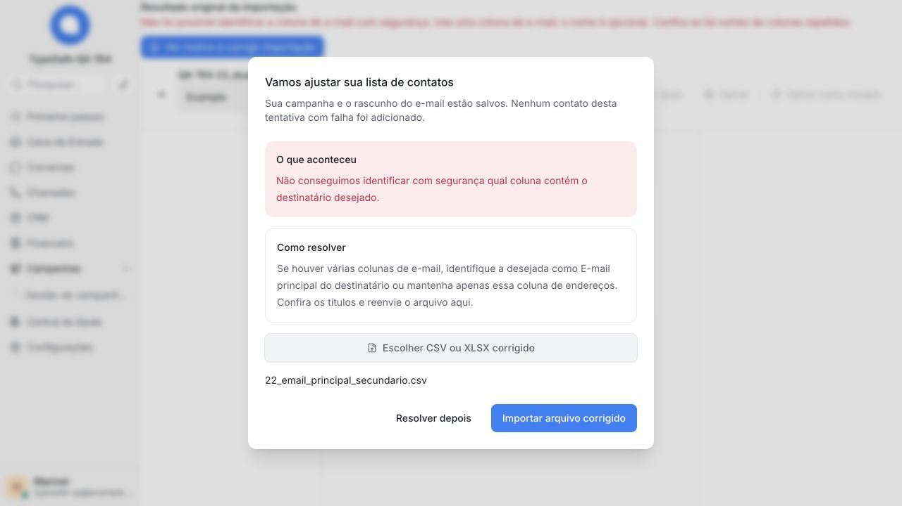
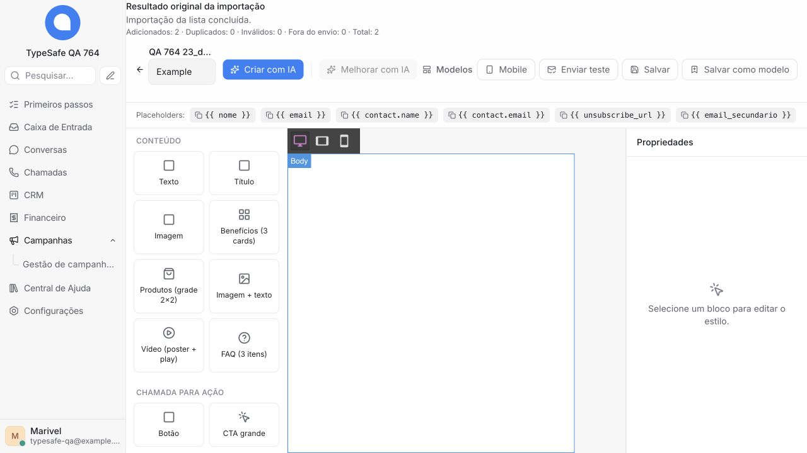

# #764 — Jev na leitura da lista e recuperação no editor

## Decisão e autorização

Rodrigo autorizou corrigir a interpretação antes de produção, adicionar uma recuperação utilizável no editor e executar 20–30 planilhas com Jev real. O limite pago foi confirmado como US$ 1. A execução ocorreu no worktree `codex/764-import-runtime-diagnosis`, separado do checkout principal. Esta etapa não executou merge, deploy, reimportação na conta 16 ou envio de e-mail.

## Problema e comportamento entregue

O diagnóstico anterior demonstrou que o XLSX original `05_duplicidade_normalizada.xlsx` era recusado por `duplicated_name_header` antes de consultar o Jev: “Cliente” e “Contato” eram tratados como dois nomes. A apresentação pública ainda reduzia essa causa a `import_failed`.

Com TypeSafe configurado e ativo, o Jev recebe cabeçalhos, perfis das colunas e até três exemplos distintos de até 80 caracteres por coluna. Endereços são mascarados; os exemplos não são persistidos no resultado da importação. O modelo diferencia pessoa de empresa, endereço de consentimento e endereço principal de secundário. O caminho sem TypeSafe continua determinístico. Erros de provedor configurado não são ocultados por uma troca silenciosa de interpretação.

As escolhas tipadas mantêm validação de modelo, índices e confiança mínima de 0,8. A pergunta booleana continua com a semântica original de resposta positiva acima de 0,5; não é usada como se fosse a confiança de uma escolha. Um candidato com endereço principal explícito teve escolhas com confiança 1 e resposta booleana 0,72 na rodada real. Duas colunas igualmente plausíveis são recusadas.

Os motivos públicos conhecidos passam por uma lista permitida; mensagens arbitrárias permanecem ocultas. O editor abre um popup quando recebe uma falha de importação em campanha editável. Ele apresenta motivo, proposta de correção e escolha de CSV/XLSX no mesmo lugar, preservando a campanha. Falhas temporárias também podem permitir repetir o arquivo original. A tela de detalhes oferece abertura manual, evitando popup automático dentro de outro diálogo. Não há mudança de contrato de rota, banco ou comportamento de envio.

## Rodada real

- Aplicação Rails de teste em `127.0.0.1:34764`, Vite isolado em `35764`, banco `email764_acceptance`, Redis isolado e conta sintética 1.
- Upload multipart real pelo endpoint do produto, processamento real, leitura pública do resultado e conferência dos registros. Respostas do Jev não foram simuladas nem reproduzidas de gravações.
- O transporte reutilizou o cliente e a configuração instalados por uma chamada operacional com sessão de banco somente leitura. A chave permaneceu na instalação; não foi copiada para scripts, variáveis, Git ou evidências. Somente amostras fictícias da rodada foram avaliadas. Importações e destinatários foram gravados exclusivamente no ambiente local de teste.
- Primeira rodada completa: 28/30 resultados esperados. Ela expôs a interpretação incorreta da probabilidade booleana no caso de endereço principal e a apresentação genérica do arquivo sem endereço válido. Após os ajustes, a rodada completa final ficou em **30/30**: 26 concluídas, quatro recusas esperadas com causa específica e zero contatos nessas tentativas.
- Os cinco arquivos originais foram usados em XLSX, com identidade de arquivo conferida; não foram substituídos por versões CSV.
- O arquivo 05 concluiu com **um contato importado e um duplicado**, distinguindo a empresa da pessoa. O caso 28 concluiu com **um elegível e três excluídos** por falha permanente, spam e descadastro. Campos adicionais e o rascunho foram conferidos.
- O conjunto completo, SHA-256 e resultados estão em [docs/testing/email-import-764](../testing/email-import-764/README.md). A cobertura não é uma garantia universal de importação de qualquer arquivo.

## Uso pago e limite

O controle local contabilizou 66 avaliações iniciadas, incluindo calibração, rodada final e reenvio pelo navegador. Uso retornado pelo provedor: 79.827 tokens de entrada; estimativa de custo **US$ 0,003352734**, usando US$ 0,042/milhão de entrada e saída gratuita conforme [documentação do modelo](https://docs.typesafe.ai/models). A fatura não foi consultada.

O transporte impôs no máximo 120 avaliações, payload limitado e reserva conservadora por tentativa incluindo três chamadas por avaliação. O teto conservador total era US$ 0,96768; a reserva das 66 avaliações foi US$ 0,532224. Ambos estão abaixo do US$ 1 autorizado. O controle serializou a contabilização para impedir que a rodada e o teste de tela ultrapassassem o mesmo orçamento.

## Evidência pelo navegador

O popup foi verificado no Chrome em tela desktop e em 390 × 844, sem transbordamento do diálogo. O envio pelo seletor do Chrome foi impedido pela permissão da extensão para arquivos locais; nenhuma permissão foi alterada. O fluxo completo de arquivo corrigido foi concluído no navegador integrado.

Na campanha sintética 24, a tentativa original 24 continuou registrada como falha `schema_not_resolved`. O arquivo 22 foi escolhido dentro do popup e produziu a nova importação 66 concluída. A tela mostrou “Adicionados: 2 · Duplicados: 0 · Inválidos: 0 · Fora do envio: 0 · Total: 2”; o popup fechou. A leitura do banco de teste confirmou dois destinatários, status rascunho e o mesmo `body_html` salvo. A demora local coincidiu com carga e pressão de memória muito altas no host; não é uma medição de desempenho de produção.

## Validação de código

- Ruby focado: 32 exemplos, zero falhas.
- Frontend: 440 testes em 14 arquivos aprovados; verificação final dos diálogos após ajuste de lint: 19 testes em três arquivos aprovados.
- RuboCop dos oito arquivos de implementação/specs e dos três arquivos de isolamento: zero infrações.
- ESLint pelo mesmo wrapper do CI: nove arquivos, zero problemas bloqueantes; 18 avisos de chaves i18n dinâmicas.
- Catálogos próprios: nove catálogos e 15.860 mensagens compiladas. Gate legado de campanhas: 57 pastas, 43 referências de runtime e 14.991 mensagens aprovado.
- Build Vite em modo de teste: 6.036 módulos, concluído; avisos de tamanho de chunks existentes.
- Regressão Ruby ampliada em banco novo: **1.041 exemplos, zero falhas, dois pendentes antigos**. Os pendentes são `CampaignImports::UndoLabelsJob` e `Account has_many autonomia_account_links`, ambos já marcados como quarentena na base; não foram desativados por esta correção.

Comandos utilizados: `bundle exec rspec` com a lista completa de 101 specs da proteção/importação e o novo spec de apresentação de erros, `bundle exec rubocop` sobre os arquivos Ruby alterados, `pnpm vitest run` para os grupos de proteção e diálogos, `node .github/scripts/email-protection-eslint.mjs` com os nove arquivos JS/Vue alterados, os gates de catálogos do fork e de campanhas e `pnpm vite build --mode test`. O ambiente inicializou rbenv e usou dependências travadas do projeto. As saídas e resumos completos foram lidos antes de preparar o commit; nenhum teste foi encadeado com commit.

A regressão inicial identificou configuração de instalação deixada por exemplos de concorrência sem transação. Três grupos passaram a usar o isolamento já existente `relationships_committed_fixtures`, sem enfraquecer suas asserções. Uma repetição em banco já usado também encontrou registros de auditoria/supressão residuais; ela foi interrompida e substituída por uma execução em banco sintético novo. Esses resultados anteriores não foram contados como aprovados.

## Revisão e liberação

Mudanças nos dois catálogos próprios seguem `config/fork_i18n.json` e a exclusão Crowdin já usada pelo fork. O diálogo compartilhado foi mantido sem alterações. Foram conferidos os caminhos OSS/Enterprise relacionados; nenhum override correspondente exige edição nesta correção.

Liberação proposta: concluir revisão e CI do PR #796, obter autorização de Rodrigo e usar o deploy blue-green do projeto. Depois, validar a apresentação e uma importação sintética autorizada na instalação publicada, sem iniciar campanha. Reversão: retornar a imagem/revisão anterior pelo fluxo de rollback existente; esta alteração não contém migração de banco. Antes da liberação, a conta 16 e sua tentativa original permanecem intactas.
