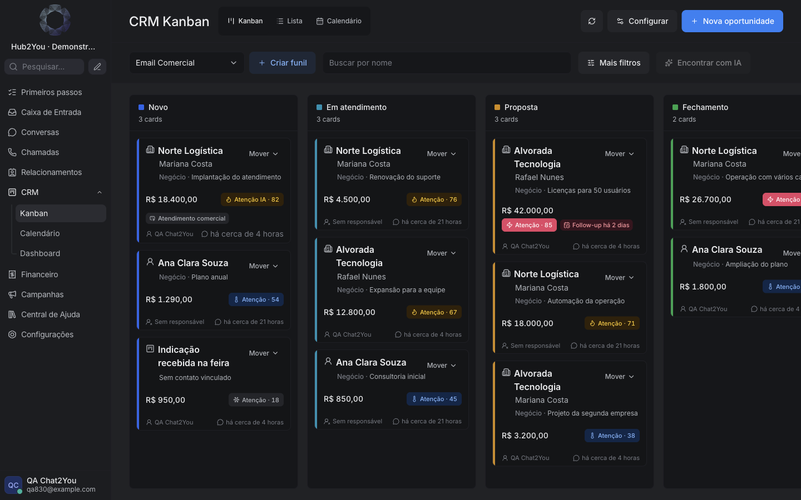
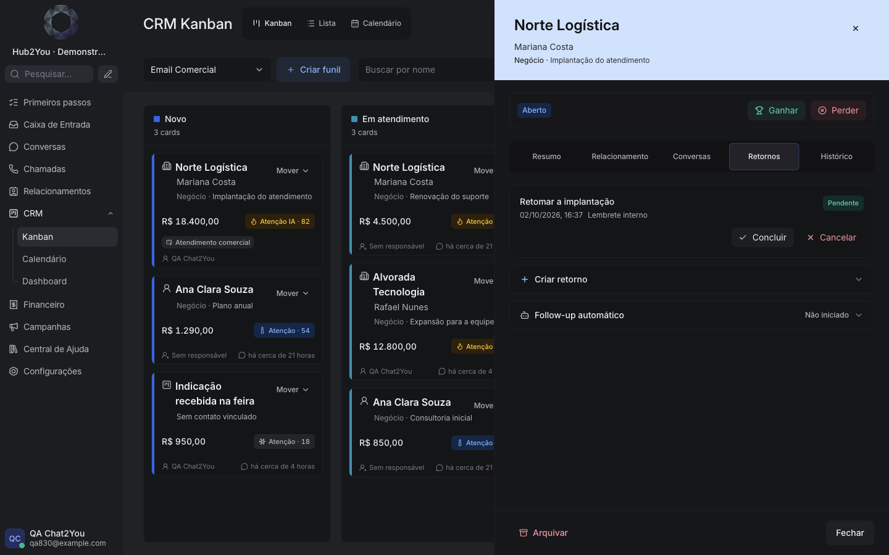

# CRM #830 — telas reais locais

Implementação em rascunho. Dados inteiramente fictícios; não representam clientes
nem resultados de IA. O trabalho foi interrompido a pedido do Rodrigo, antes de
aprovação visual final, CI remoto, merge ou deploy.

| Tela | Captura |
| --- | --- |
| Kanban | [Desktop](screenshots/01-kanban.png) |
| Resumo | [Desktop](screenshots/02-resumo.png) |
| Relacionamento | [Desktop](screenshots/03-relacionamento.png) |
| Conversas | [Desktop](screenshots/04-conversas.png) |
| Retornos | [Desktop](screenshots/05-retornos.png) |
| Histórico | [Desktop](screenshots/06-historico.png) |
| Empresa distinta da Prospecção | [Desktop](screenshots/08-prospeccao.png) |
| Kanban mobile | [390px](screenshots/09-mobile-kanban.png) |
| Retornos mobile | [390px](screenshots/10-mobile-retornos.png) |

Mais filtros foi validado funcionalmente, mas sua captura limpa fica pendente.
O tema escuro usa a preferência da sessão local. A rolagem horizontal dos status
foi confirmada em navegador, inclusive Fechamento e Perdido.

Detalhes de validação e retomada:
[auditoria](../../audit/2026-10-01-830-kanban-client-identity.md).
