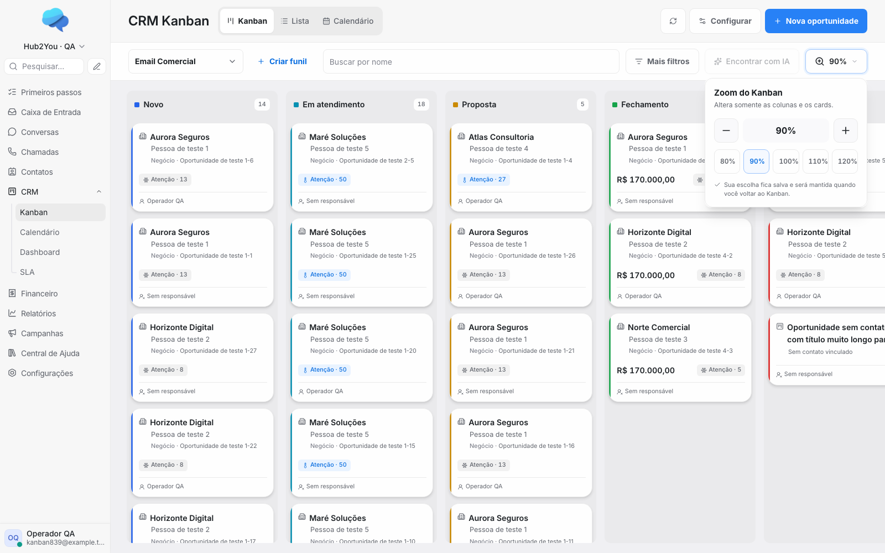
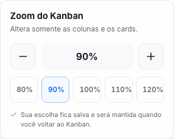
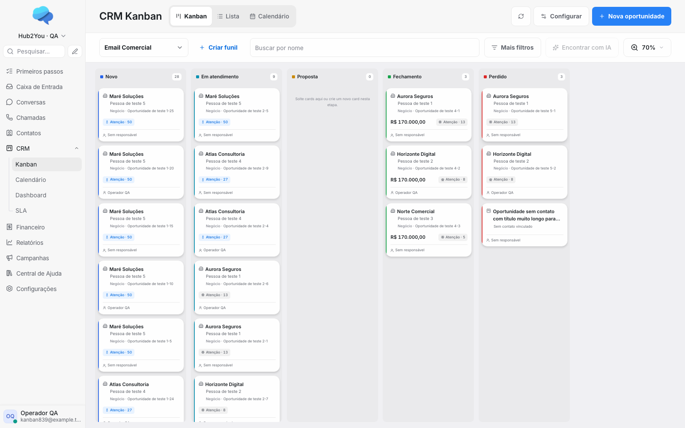
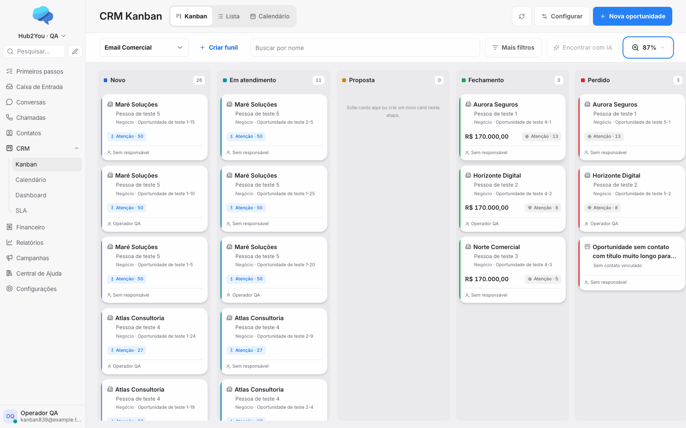
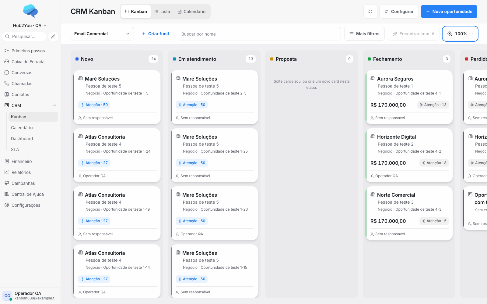
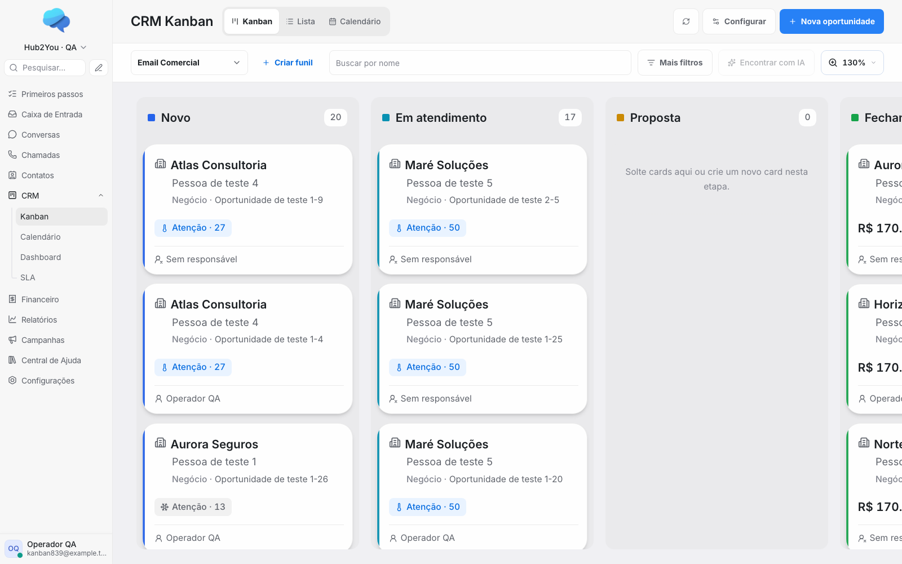
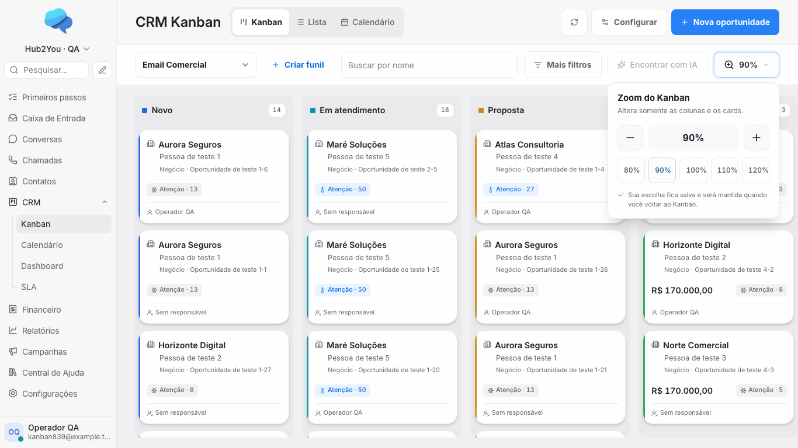
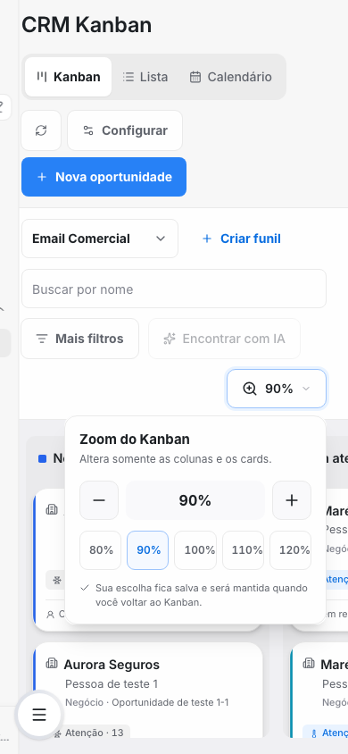

# Evidências do zoom do Kanban — #839

Capturas da aplicação real desta branch, em ambiente local isolado com oportunidades, empresas e contas sintéticas. Não são imagens do HTML de referência nem de produção.

Referência aprovada: `mockup_crm_kanban_zoom.html`, SHA-256 `7ab512c2c694e3852f06dabc4e7f65c967b8b1e8a09cc309a89ea1f5b69076c8`.

## Resultados de navegador

[matriz principal](browser-chromium.json): **34 verificações aprovadas**, sem erros de execução do navegador. [regressões de interação](interactions-chromium.json): **30 verificações aprovadas**, sem erros de execução. São grupos de verificações; não representam a contagem de todos os asserts.

A matriz cobre os percentuais **70/80/87/90/100/110/117/120/130**, zoom exclusivo do quadro, geometria, rolagem, limites, presets, ausência de requisições de dados ao ajustar, persistência, navegação, contas, teclado e responsividade. A movimentação real entre etapas foi confirmada por resposta da API e recarga da tela. O teste de toque usa 70/87/100/117/130. A segunda matriz cobre, nos nove níveis, arraste até a última etapa, ausência de reordenação manual e ausência de abertura indevida de card após arrastar e retornar; inclui busca e reinício real do navegador.

## Comparação com a referência

| Elemento | Resultado e decisão |
| --- | --- |
| Ordem da barra | Mantida: funil, criar funil, busca, filtros, IA, zoom. |
| Criar funil | O link segue sem moldura decorativa. |
| Controle de zoom | Lupa, percentual e seta; largura fixa para evitar deslocamento entre 99% e 100%. |
| Popover | Largura de 294 px, título, descrição, menos/percentual/mais, cinco presets e mensagem de persistência. |
| Contornos | Bordas visíveis de 1 px, inclusive nos presets e botões; verificação do estilo computado incluída no teste. |
| Ajuste fino | O plano posterior ao HTML amplia cinco níveis fixos para todos os 61 inteiros entre 70 e 130. |
| Dimensões de interação | Preservados os 44 px de controles do produto; presets ampliados de 34 para 44 px para toque/teclado. |
| Conteúdo dos cards | Mantida a renderização atual do produto; dados de QA são fictícios, não cópia das oportunidades do mockup. |
| Demais telas e painéis | Lista, Calendário, filtros e drawers não recebem escala. |

## Imagens

### Popover e barra

### Limites e valor intermediário

### Responsividade

## Reprodução e abrangência

O navegador desta aprovação local é **Chromium/Playwright**. Não atribuir aprovação a outro navegador pela mera existência destas capturas. O plugin Browser não estava disponível; foi usado Playwright da própria worktree.

O roteiro e a proteção contra execução em produção estão em [QA local](../../../tests/qa/kanban-zoom/README.md). Preferências e rollback estão em [documentação funcional](../kanban-zoom.md). Revisões e demais validações estão na [auditoria](../../audit/2026-10-02-839-kanban-zoom.md).
