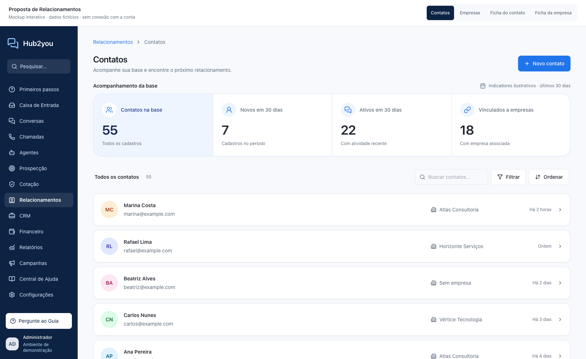
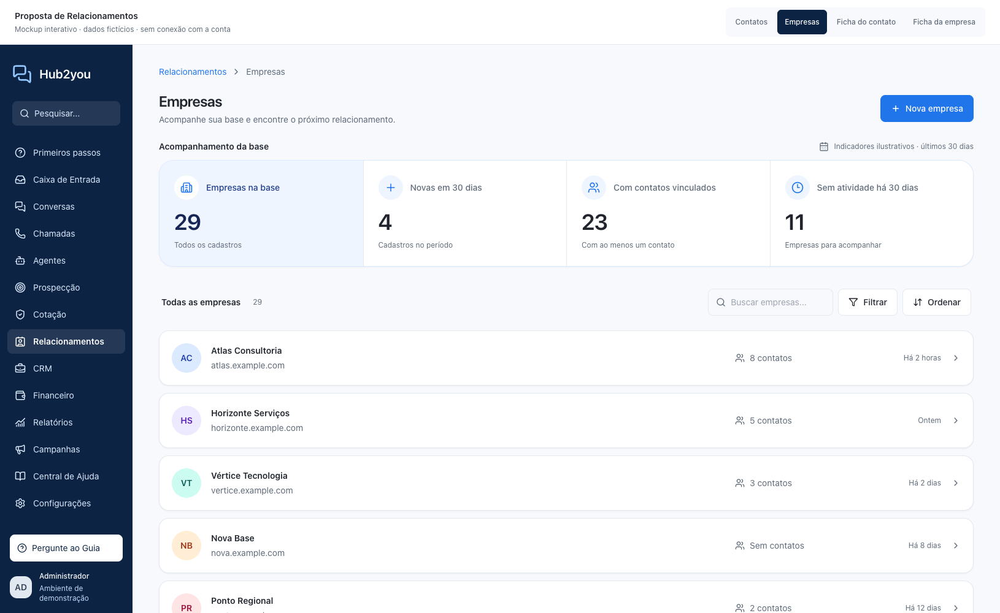
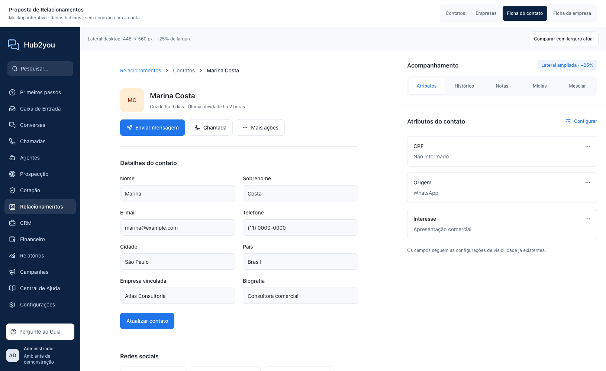
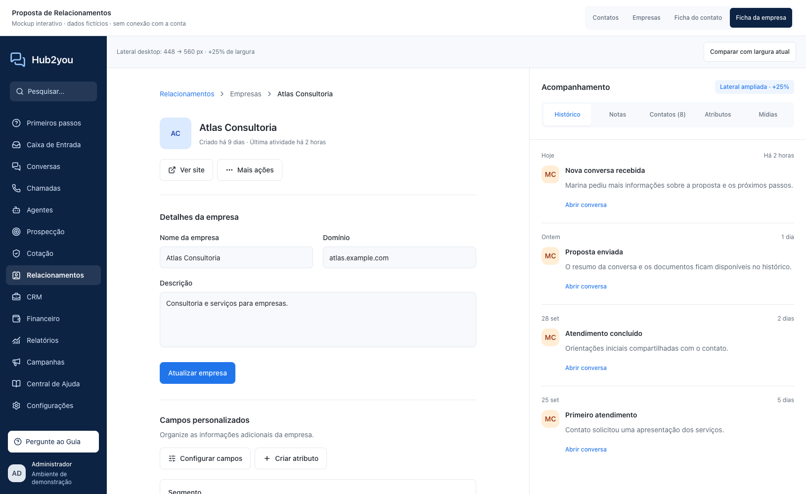
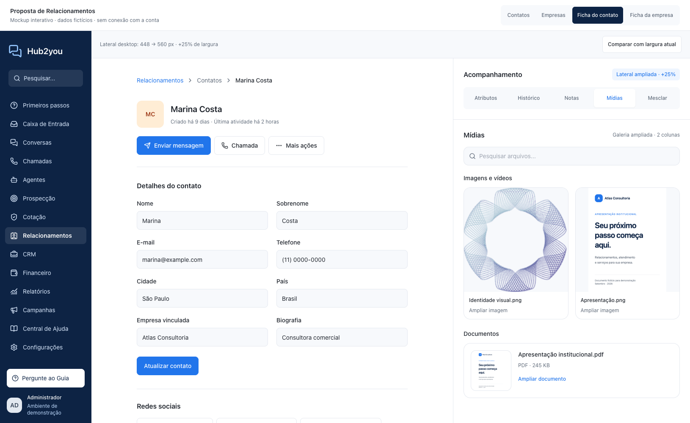
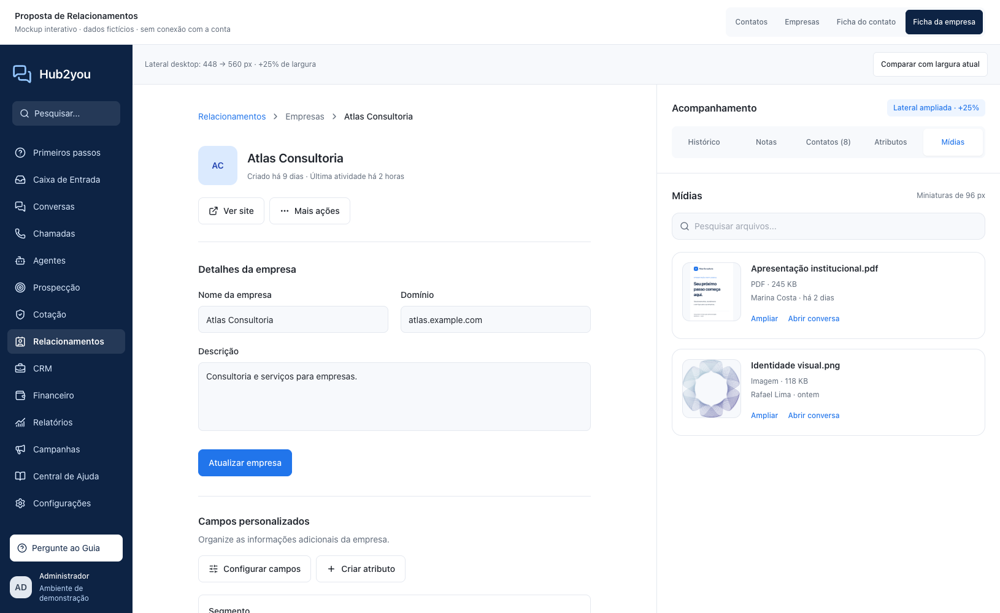

# Proposta visual — Relacionamentos — #785

Segunda versão do mockup para aprovação de Rodrigo. A composição interna das fichas teve aceite visual parcial; as listas foram revistas após o feedback sobre os blocos retos. Não é implementação da aplicação. Os dados são fictícios; nenhuma API da conta, destinatário, mensagem ou credencial é consultada. A marca do exemplo acompanha as capturas; a implementação deve continuar usando branding por instalação.

## Ver

Protótipo local: `http://127.0.0.1:37850/`. Alternar as quatro telas na barra superior. Nas fichas, usar **Comparar com largura atual** e as abas. Em telas menores, usar **Abrir acompanhamento** e Fechar/Escape.

A busca funciona sobre os exemplos locais. Nas fichas, abrir a aba Mídias para ver as prévias ampliadas; o menu Mais ações mantém Bloquear contato/Excluir empresa na demonstração. Botões de cadastro, atualizar, mensagem, chamada, exclusão e configuração apenas mostram que nenhuma ação real foi executada.

| Lista de contatos | Lista de empresas |
| --- | --- |
|  |  |

| Ficha do contato | Ficha da empresa |
| --- | --- |
|  |  |

## Recomendação

- Dashboard em faixa única arredondada, com ícones circulares e quatro indicadores úteis; manter busca, filtros e paginação. Os números não mudam de acordo com a página carregada.
- Listas com itens separados, cantos mais suaves e avatares circulares; sem a aparência de tabela reta rejeitada na primeira versão.
- Contatos: total da base, cadastros nos últimos 30 dias, atividade nos últimos 30 dias, vínculo com empresa.
- Empresas: total da base, cadastros nos últimos 30 dias, empresas com contatos, empresas sem atividade há 30 dias.
- Lateral das fichas: limite atual 28rem (448px) → proposta 35rem (560px), +25% no desktop. Atributos, histórico, notas, mídias e ações atuais seguem disponíveis. Abas completas e rolagem independente.
- Ações abaixo da identificação: Enviar mensagem e Chamada à vista; Bloquear contato dentro de Mais ações. Desktop em uma linha; telas menores com grade planejada, sem quebra acidental no breadcrumb. Excluir empresa também fica em Mais ações.
- Mídias da empresa: contêiner de miniatura de 96px, versus size-12 (48px) no componente atual. A borda interna deixa a imagem com 94px no mockup. No contato, galeria de duas colunas com prévias de aproximadamente 246px no desktop e documentos com miniatura de 96px. Os tamanhos se adaptam à lateral.
- Abaixo de 1280px, usar painel de acompanhamento sobreposto para não comprimir o formulário. O protótipo demonstra esse comportamento; preservar ações e tratamento de foco do painel existente na implementação.

## Inclusão e compatibilidade

A proposta é acrescentar componentes próprios em components-next/Relationships, com um encaixe opcional para o resumo nos layouts de lista e configuração opcional da largura nos layouts das fichas. Reutilizar slots e componentes atuais de conteúdo; não clonar telas inteiras, não injetar DOM/CSS por seletor, não alterar contratos de gravação.

É inevitável um pequeno ajuste nos pontos que recebem os novos componentes. Isolar esse ajuste reduz conflitos com upstream; não garante compatibilidade automática com toda versão futura. Revisar esses encaixes após upgrade. A reorganização visual do formulário/lista no mockup é ilustrativa: implementação deve priorizar os dois pedidos, reutilizando a composição atual e evitando uma reescrita de cadastro.

Tailwind, tokens e i18n do projeto; branding configurável. O catálogo local próprio segue a política vigente do fork. O protótipo usa utilitários compilados localmente e ícones Lucide já disponíveis no repositório; não requer dependência nova na aplicação.

## Dependência dos indicadores

Totais já estão disponíveis em contacts/getMeta e companies/getMeta. As APIs atuais consultadas não fornecem todos os agregados propostos por período e vínculo. Para exibir os quatro indicadores corretamente, será necessário um endpoint adicional somente de leitura, respeitando conta, permissões e timezone, sem alterar endpoints existentes. Esse trabalho é uma dependência explícita do aceite da proposta completa; não foi implementado aqui.

Se o escopo aprovado for estritamente frontend, começar com os totais disponíveis e omitir os indicadores sem agregado real. Nunca extrapolar a primeira página, carregar todos os registros no navegador ou apresentar número fictício em produção.

“Atividade” deve seguir last_activity_at do domínio; “novos” usa created_at. Para empresas, distinguir nunca teve atividade de última atividade anterior a 30 dias na definição do agregado antes de implementar. Não chamar uma empresa sem atividade de oportunidade, tarefa ou pendência comercial sem esses dados.

## Evidência e limite

Protótipo executado no Chrome headless em larguras 1630, 1440, 1280, 1024 e 390px. Trinta capturas privadas, seis previews preservados, zero erros de JavaScript e nenhuma rolagem horizontal de página nos estados verificados. Lateral medida em 560px e comparação em 448px, razão 1,25. Botões sem corte e alinhados em uma linha no desktop 1280/1440; imagens de miniatura carregadas e medidas. Abas sem corte nos estados verificados; troca de histórico, busca local e abrir/fechar/Escape do painel exercitados. Relatório em browser-report.json.

Isso comprova a proposta local; não valida integração da aplicação, responsividade em toda resolução, tema escuro, permissões ou regressão de produção. Após aceite visual: implementação mínima, revisão, testes e aprovação específica antes de merge/deploy desta nova frente.

## Reproduzir

Da raiz do repositório:

```sh
python3 -m http.server 37850 --bind 127.0.0.1 --directory docs/relationships/mockups/785
```

CSS já compilado e independente de rede. A prévia do documento é fictícia, renderizada a partir de assets/presentation.html; o outro exemplo usa o ícone de marca já existente no repositório, sem arquivo de cliente. Para recompilar após editar o mockup, usar tailwindcss instalado no projeto e entrada com as diretivas base/components/utilities; configuração em tailwind.config.cjs. Ícones SVG extraídos de @iconify-json/lucide; projeto Lucide, licença ISC.

## Prévia das mídias ampliadas

| Contato | Empresa |
| --- | --- |
|  |  |
